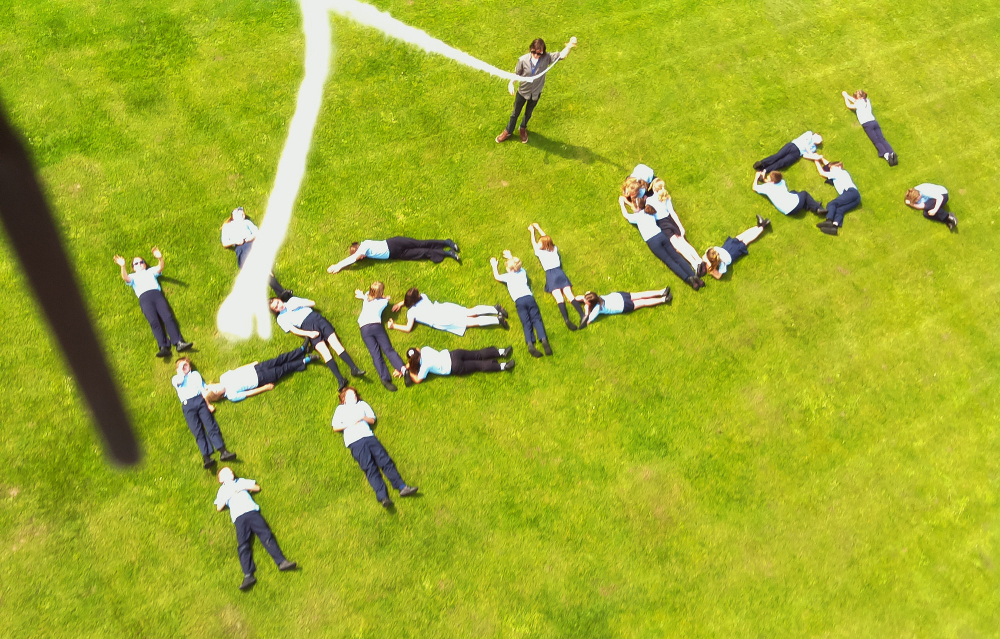
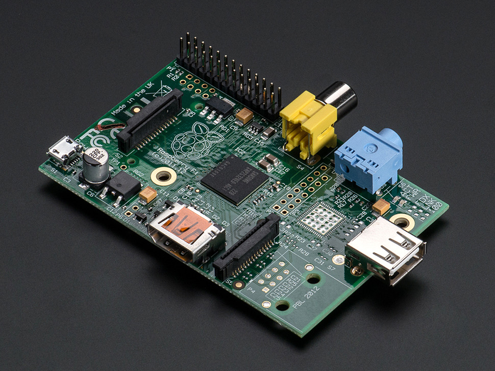

% Aerial Photography
% PIffIN
%

# Aerial Photography

\ 

## Introduction

This workshop uses helium to lift and a Raspberry Pi computer that then takes photos from 20m up in the air. 
Children design the program, calculate the amount of helium needed and then take some aerial photos.

# Learning objectives

* Main components of a computer,
* Sequences and Loops as fundamental concepts in programming,
* Writing a simple program,
* Computers can control cameras, be small and light,
* Helium is a way to get lift for a balloon,
* Calculate how big the balloon needs to be to lift the computer.

# Resources

* Raspberry Pi,
* Pi camera,
* Scales
* 200g weather balloon,
* 20m string on a winder,
* 8 [copies of the handout](aerial-handout.html)
* 8 copies of the scratch blocks

# Preparation

* Risk assess the launch area:
    * There must be no over head wires 50m in all directions from the launch spot.
    * Balloon must be filled and emptied outside.
* Check the Pi boots up and you can use the projector. Navigate to the 'presentation' directory on the desktop.
* Check all photos are deleted from the Pi (see the payload manual).
* Put the battery on charge.

# Lesson Plan

* We're going to build an aerial photography robot!
* What's in the payload?
* Writing a program and using a loop.
* How to get lift. 
* Launch, photos and recovery.
* Plenary.

## Introduction : 10 minutes

Show the picture 1-aerialphoto.

Explain to the children that we're going to build an aerial photography platform to take photos from 20 metres up in the air. We need their help to get it to work.

Q: What do we need to make this happen?

A: a payload with a camera that can take lots of photos,

A: a balloon to lift it in the air.

A: something to power it.

## Payload : 5 minutes

Q: what is our payload going to be?

A: camera, but how do we get it to take photos over and over? Use a computer

Q: what's inside a computer?

A: show picture of Raspberry Pi (2-raspi-3d) and explain components: CPU, memory, USB ports, power socket, GPIO

\ 

### Program your robot : 25 minutes

Show the robot programming tables (3-robot).

The most fundamental part of programming a computer is understanding that programs are made up of a sequence of commands.

It's important for us to also understand that a computer doesn't have any intelligence - it has to be told exactly what to do. So when the program is wrong, the computer does the wrong thing.

We want to help the children realise the importance of loops by making them repeat their commands many times.

Ask the students to design a (simple) obstacle course by moving chairs about. Have a start and end point. Ensure there is a diagonal section.

Ask the students what commands the robot will need, and to write them down on their handouts. For example `forward` will make the robot take 1 step forward. Ensure only 90 degree left and right turns are used.

And we always have a `start` and `stop` code with associated sound effects!

Ask the students in groups of 4 to write down a program in their handouts that will navigate a robot successfully through the obstacle course.

For each team, ask for a volunteer robot and a volunteer programmer to see how well they complete the course. Force the robot to follow the programmer's instructions exactly. Computers have to follow the exact instructions given.

The programs will include lots of repetition because we have the diagonal and only left 90 and right 90 turns. 

Q: how can we reduce the amount of writing we have to do?

A: loop some parts of the program.

Show on the projector a simple Scratch program that does what our robot had to do. These 2 programs are in the 'presentation' folder:

\ 

Then adjust the program to create a loop:

\ 

### Scratch program : 10 minutes

Q: what would our program to take photos look like in Scratch?

Activity: hand out printed scratch blocks and get children to arrange on the table in front of them. Kids in groups of 4.

## Raspberry Pi : 5 minutes

* Run the balloon program (on the desktop). Show the children how similar the program is to the they made. Explain the differences:
    * autostart makes the scratch program start without having to click the green flag,
    * pin8high and pin8low are controlling the LED,
    * broadcast photo is what takes the photo.
* Show how it flashes a light and takes a photo.
* Show an example photo.

## Power : 5 minutes

Q: How can we get the power?

A: Batteries, solar panels, etc. We'll be using a small rechargable battery. Show the battery.

## Lift : 25 minutes

Show the worksheet picture (6-worksheet).

Q: How can we get lift?

A: With a gas that's lighter than air, or hot air, or propellors like a helicopter. We're using helium today. Which has a lift of 1100g per cubic metre. So one cubic metre could lift 1100g.

Q: How big a balloon do you think we need? Get children to guess. 

Q: How could we work it out?

Q: How much lift required?

A: We have to weigh the missing parts from the worksheet. Do the weighing and ask children to write down the numbers. Get the children to work out the total weight. It should be around TODOg

Q: How big do we need the balloon to get the required lift? 

A: We can work it out with maths.

Activity: Ask children to fill in worksheets to work out how big the balloon should be.

## Launch! : 30 minutes

* Go outside to designated and risk assessed area,
* Fill balloon,
* Pay out the balloon up to a maximum set by your risk assessment.
* Get the children to look up, make some shapes, spell some letters.
* Wind back the balloon.
* Deflate balloon.

## Plenary : 10 minutes

Questions to ask:

* What are the essential parts of a computer?
* How do we avoid repeating ourselves as programmers?
* How much helium do we need to lift the computer?
* How did we power the computer?
* What did you like best?
* What did you learn?

# Cleanup

## Get photos off the Pi.

* Use the USB hub to copy photos from SD card onto USB stick.
* Backup and delete the photos, otherwise the card will quickly run out of space.

